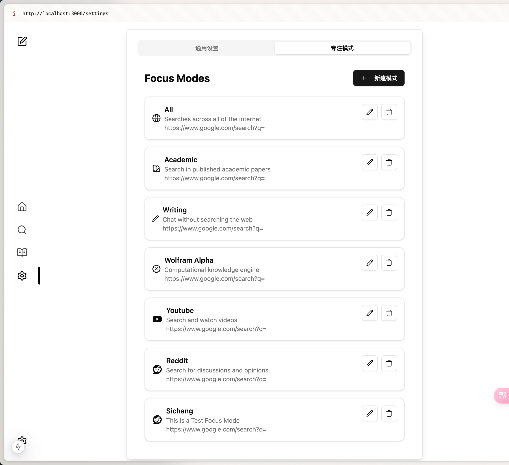
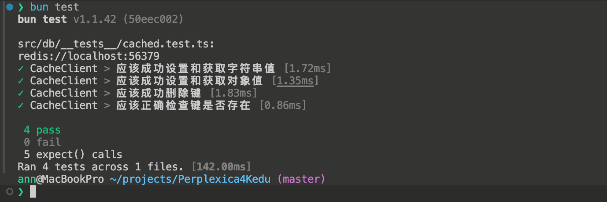

# 运行

本机运行

```bash
bun dev
cd mcp-server && bun dev
cd ui && bun dev
```

或者 docker-compose运行

```bash
docker-compose up -d
```

优化后的 [docker-compose.yml](docker-compose.yml)

```bash
services:
  searxng:
    image: docker.io/searxng/searxng:latest
    volumes:
      - ./searxng:/etc/searxng:rw
    ports:
      - 4000:8080
    networks:
      - perplexica-network
    restart: unless-stopped

  perplexica-backend:
    build:
      context: .
      dockerfile: backend.dockerfile
    image: itzcrazykns1337/perplexica-backend:main
    environment:
      - SEARXNG_API_URL=http://searxng:8080
      - MCP_SERVER_URL=http://mcp-server:3001
    depends_on:
      - searxng
      - mcp-server
    ports:
      - 3001:3001
    volumes:
      - backend-dbstore:/home/perplexica/data
      - uploads:/home/perplexica/uploads
      - ./config.toml:/home/perplexica/config.toml
    extra_hosts:
      - 'host.docker.internal:host-gateway'
    networks:
      - perplexica-network
    restart: unless-stopped

  perplexica-frontend:
    build:
      context: .
      dockerfile: app.dockerfile
      args:
        - NEXT_PUBLIC_API_URL=http://127.0.0.1:3001/api
        - NEXT_PUBLIC_WS_URL=ws://127.0.0.1:3001
    image: itzcrazykns1337/perplexica-frontend:main
    depends_on:
      - perplexica-backend
    ports:
      - 3000:3000
    networks:
      - perplexica-network
    restart: unless-stopped

  redis:
    image: redis:alpine
    ports:
      - '6379:6379'
    volumes:
      - redis_data:/data
    restart: always

  mcp-server:
    build:
      context: .
      dockerfile: Dockerfile.mcp
    ports:
      - "3002:3002"


networks:
  perplexica-network:

volumes:
  backend-dbstore:
  uploads:
  redis_data:

```

## 题目1（前端）：新增高级 Focus 模式管理界面



### 视频

[下载视频](docs/Screen%20Recording%202024-12-24%20at%2015.47.49.mov)
<video src="docs/Screen%20Recording%202024-12-24%20at%2015.47.49.mov" controls="controls" style="max-width: 730px;">
</video>

## 题目2（后端）：实现 Redis 缓存层优化搜索结果



### 视频

[下载视频](docs/Screen%20Recording%202024-12-24%20at%2016.20.35.mov)
<video src="docs/Screen%20Recording%202024-12-24%20at%2016.20.35.mov" controls="controls" style="max-width: 730px;">
</video>

## 题目3（后端）：整合 MCP 到 Perplexica，支持文字转图片功能

### 开发进度

目前已完成:

- MCP Server 的基础功能开发
- Docker 容器化配置

待优化事项:

1. 类型兼容性问题
   - Perplexica 项目与 @modelcontextprotocol/sdk 存在 Node.js 类型定义差异
   - 需要进行类型定义的统一和适配

2. 集成优化
   - 需要重构部分代码以更好地支持 MCP 协议
   - 优化 WebSocket 通信层以支持图片生成功能

3. 性能优化
   - 优化图片生成和传输流程
   - 实现更高效的数据交换机制

### 后续计划

1. 解决类型兼容性问题
2. 完善 MCP 集成文档
3. 添加更多单元测试
4. 优化错误处理机制

> 注: 由于技术栈整合的复杂性，该功能仍在持续优化中。
